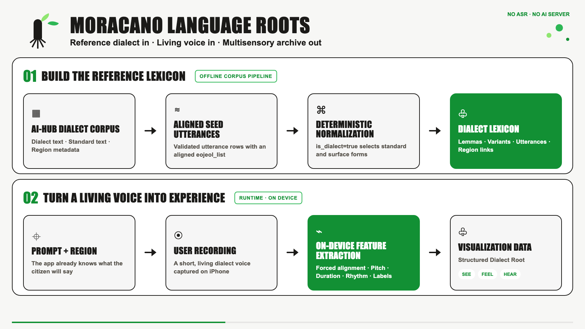
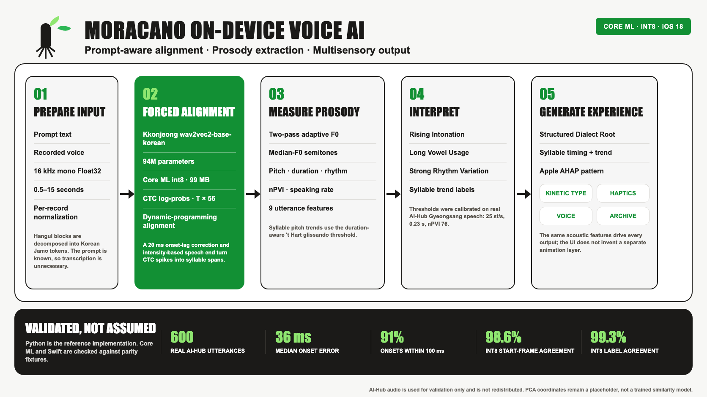
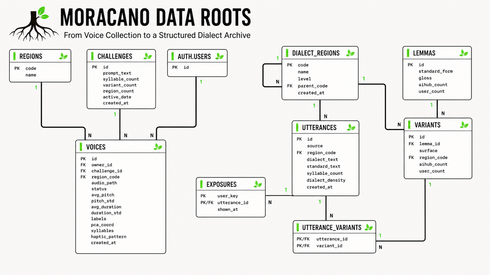

# moracano backend & AI

Moracano는 짧은 방언 발화를 음절 단위로 정렬하고, 피치·길이·리듬을 분석해 시각·촉각·청각
인터랙션으로 변환하는 **온디바이스 음성 AI 프로젝트**입니다.

이 저장소의 중심은 Supabase 서버가 아니라 다음 세 가지입니다.

1. iOS Core ML에서 실행되는 Korean Jamo CTC 강제정렬 모델
2. 음절별 운율 분석과 해석 가능한 라벨·햅틱 생성 알고리즘
3. Python 기준 구현과 AI-Hub 실발화 검증·Core ML 변환·Swift parity 도구

실제 서비스는 별도의 Python/FastAPI 분석 서버를 호출하지 않습니다. iOS가 녹음과 Core ML 추론,
운율 분석을 로컬에서 수행하고, 저장 계층은 제시문·방언 사전·분석 결과와 private 오디오를 보관하는
역할만 담당합니다.

## 두 개의 데이터 흐름

Moracano는 기준 방언을 준비하는 오프라인 흐름과 시민의 현재 발화를 분석하는 런타임 흐름을
분리합니다.



### Reference dialect: corpus에서 lexicon으로

```text
AI-Hub dialect corpus -> aligned seed utterances -> dialect lexicon
```

AI-Hub/curated corpus는 방언 문장, 표준어 문장, 지역 메타데이터와 정렬된 `eojeol_list`를
입력으로 사용합니다. `scripts/seed_challenge_sentences.py`는 `is_dialect=true`인 항목의
`standard`와 `surface`를 각각 `lemmas`와 `variants`로 정규화하고, 이를 `utterances`와 연결합니다.

현재 구현은 자유 문장에서 표제어를 추론하는 NLP 모델이 아닙니다. 검증된 `eojeol_list`를
결정적으로 정규화하는 파이프라인이며, 이 경계를 통해 원문·표준형·방언 표면형의 연결을 재현 가능하게
유지합니다.

### Living voice: 녹음에서 인터랙션으로

```text
User recording -> on-device feature extraction -> visualization data
```

사용자가 지역과 제시문을 선택하면 iOS는 발화를 녹음하고, 이미 알고 있는 제시문을 기준으로 음절을
강제정렬합니다. 정렬된 구간에서 피치·길이·리듬을 계산한 뒤 `syllables`, `labels`,
`haptic_pattern`을 생성합니다. 동일한 음향 피처가 키네틱 타이포그래피, Core Haptics, 음성 재생,
Dialect Root 아카이브의 공통 입력이 됩니다.

## 온디바이스 AI 파이프라인



### 1. Prompt-aware forced alignment

Moracano는 사용자가 읽을 제시문을 이미 알고 있으므로 ASR로 다시 전사하지 않습니다.

- 녹음을 16kHz mono Float32로 맞추고 발화별 정규화를 적용합니다.
- 한글 완성형을 초성·중성·종성 자모로 분해해 `Kkonjeong/wav2vec2-base-korean`의 자모 vocab에
  매핑합니다. 자모 vocab이라 `쫌`, `괜`, `걍` 같은 완성형 OOV 문제를 피할 수 있습니다.
- wav2vec2 CTC의 `log_probs (T, 56)`와 제시문 토큰을 dynamic programming으로 강제정렬합니다.
- CTC onset이 실제 onset보다 늦는 경향을 보정하기 위해 20ms를 앞당깁니다.
- CTC spike는 실제 음절 길이가 아니므로 각 음절의 끝을 다음 음절 onset까지 확장합니다. 마지막
  음절은 Praat 방식 intensity가 구간 peak보다 20dB 낮아지는 지점을 발화 끝으로 사용합니다.

구현: `src/moracano_ai/align.py`, `src/moracano_ai/prosody.py`

### 2. Speaker-normalized prosody analysis

고정된 F0 탐색 범위는 일부 화자에서 octave jump를 만들기 때문에 2-pass 피치 추정을 사용합니다.
먼저 60–700Hz 범위에서 유성 프레임의 q25/q75를 구하고, 화자에 맞춘 floor/ceiling으로 F0를 다시
추출합니다.

피치 변화는 Hz가 아니라 발화 중앙값 F0 기준 반음으로 변환합니다. 따라서 기본 음높이가 다른 화자도
비교 가능한 방향과 기울기를 얻습니다. 음절별 상승·하강·평탄 판정은 고정 임계값이 아니라 음절 길이를
반영하는 't Hart 글리산도 역치 `0.16 / max(T, 0.08)^2`를 사용합니다.

`compute_features()`가 계산하는 발화 단위 피처는 9개입니다.

| Feature | 의미 |
| --- | --- |
| `avg_pitch`, `pitch_std`, `pitch_range` | 평균 F0, 억양 기복, 피치 범위 |
| `pitch_slope_end` | 마지막 200ms의 최소제곱 반음 기울기 |
| `syllable_count` | 강제정렬된 음절 수 |
| `avg_duration`, `duration_std` | 평균 음절 길이와 길이 변동 |
| `npvi` | 인접 음절 길이차를 정규화한 리듬 불규칙성 |
| `speaking_rate` | 초당 음절 수 |

구현: `src/moracano_ai/features.py`, `src/moracano_ai/prosody.py`

### 3. Interpretable labels

AI-Hub 경상도 실발화 600개의 분포로 두드러진 운율을 판정하는 임계값을 캘리브레이션했습니다.

| Label | 현재 기준 | 의미 |
| --- | --- | --- |
| `Rising Intonation` | `pitch_slope_end > 25 st/s` | 발화 끝의 뚜렷한 상승 억양 |
| `Long Vowel Usage` | `avg_duration > 0.23s` | 상대적으로 긴 음절 발화 |
| `Strong Rhythm Variation` | `nPVI > 76` | 인접 음절 길이 변화가 큰 리듬 |

이 라벨은 “얼마나 방언스러운가”를 분류하는 점수가 아니라, 녹음에서 관찰된 운율 특성을 사람이
이해할 수 있는 언어로 바꾼 결과입니다.

구현: `src/moracano_ai/labels.py`, `scripts/calibrate_thresholds.py`

### 4. Acoustic features to interaction UI

분석 결과는 화면용 장식값을 별도로 만드는 대신 동일한 음향 피처에서 직접 파생됩니다.

- **Kinetic typography**: `syllables[].start/end/pitch_trend`로 글자의 타이밍과 이동 방향을 결정합니다.
- **Core Haptics**: 음절 길이로 `EventDuration`과 intensity를 만들고, rising/falling trend로
  sharpness와 `ParameterCurve`의 끝 강도를 결정합니다.
- **Original voice**: 사용자가 자신의 원본 발화를 분석 결과와 함께 다시 재생합니다.
- **Structured Dialect Root**: 지역·제시문·피처·라벨·음절 트렌드·AHAP 패턴을 하나의 분석 결과로
  연결합니다.

`build_ahap_pattern()`의 출력은 Apple AHAP 구조이므로 iOS에서
`CHHapticPattern(dictionary:)`에 직접 전달할 수 있습니다.

구현: `src/moracano_ai/haptic.py`, `mocks/on-device-analysis-contract.json`

## Core ML 온디바이스 전환

Python 구현은 알고리즘의 기준값을 생성하는 reference implementation입니다. 실제 앱에는
`Kkonjeong/wav2vec2-base-korean` 94M 모델을 Core ML로 변환한 int8 패키지를 사용합니다.

| 항목 | 결정 |
| --- | --- |
| 입력 | `audio (1, L)` Float32, 16kHz, 0.5–15초 RangeDim |
| 출력 | `log_probs (1, T, 56)` Float32 |
| 배포 타깃 | iOS 18, Core ML `mlprogram` |
| fp16 패키지 | 189MB |
| 출하 변형 | per-channel int8, 약 99MB |
| 정밀도 보호 | feature extractor conv 7개와 `lm_head` 약 9MB는 fp16 유지 |
| 단일 명세 | `src/moracano_ai/spec.py` → `alignment_spec.json` |

0 padding을 사용하는 고정 EnumeratedShapes는 라벨 일치율을 떨어뜨려 제외했고, 입력 길이를 유지하는
RangeDim을 선택했습니다. 입력 정규화도 모델 내부에 포함해 Python과 Swift의 전처리 차이를 줄였습니다.

- 변환: `scripts/export_coreml.py`
- 양자화 비교: `src/moracano_ai/quant_sim.py`

## 실제 방언 데이터 검증

AI-Hub 경상도 방언 실발화 600개(young/old 각 300)와 기존 MFA 정렬을 기준으로 평가했습니다.
AI-Hub 라이선스 조건에 따라 원본 오디오는 저장소에 재배포하지 않습니다.

| 검증 항목 | 결과 |
| --- | --- |
| base 모델 onset 오차 중앙값 | 36ms |
| onset 50ms 이내 | 64% |
| onset 100ms 이내 | 91% |
| int8 음절 시작 프레임 일치율 | 98.6% |
| int8 라벨 일치율 | 99.3% |
| 599발화 라벨 분포 | Rising 11% · Long Vowel 26% · Strong Rhythm 26% |

`export_parity_fixtures.py`는 AI-Hub 40개와 커밋 가능한 `sample.wav`에 대해 CTC frame path,
음절 경계, F0/intensity track, 9개 피처, 라벨, AHAP을 JSON으로 내보냅니다. Swift가 같은 형식으로
결과를 출력하면 `compare_parity.py`가 19개 기준으로 Python과의 차이를 PASS/FAIL로 판정합니다.

검증: `scripts/validate_alignment.py`, `scripts/export_parity_fixtures.py`,
`scripts/compare_parity.py`, `tests/test_parity_fixtures.py`

## Repository map

| Path | 역할 |
| --- | --- |
| `src/moracano_ai/align.py` | wav2vec2 CTC 추론과 음절 강제정렬 |
| `src/moracano_ai/prosody.py` | adaptive F0, intensity, 반음·glissando·nPVI |
| `src/moracano_ai/features.py` | 음절 트렌드와 9개 피처 계산 |
| `src/moracano_ai/labels.py` | 실측 임계값 기반 운율 라벨 |
| `src/moracano_ai/haptic.py` | 음절 운율을 Apple AHAP으로 변환 |
| `src/moracano_ai/spec.py` | Python–Swift 공통 상수와 parity 허용오차 |
| `src/moracano_ai/service.py` | 로컬 검증용 `/analyze`; 프로덕션 서버가 아님 |
| `scripts/export_coreml.py` | fp16/int8 Core ML 패키지와 명세 export |
| `scripts/validate_alignment.py` | AI-Hub–MFA 정렬 품질 검증 |
| `scripts/compare_parity.py` | Python–Swift 출력 parity 검증 |
| `scripts/seed_challenge_sentences.py` | 정렬된 corpus를 lemma/variant lexicon으로 정규화 |

## 저장 계층 요약

저장 계층은 AI 파이프라인의 입력과 결과를 연결하기 위한 보조 역할만 합니다.

- 기준 lexicon과 challenge는 public read-only로 조회합니다.
- 원본 사용자 오디오는 owner별 private Storage에 저장합니다.
- 온디바이스 분석 결과는 `voices` row에 기록합니다.
- 별도 AI 서버나 서비스 계정 키를 iOS 앱에 두지 않습니다.

<details>
<summary>Persistence schema 보기</summary>



</details>

## 현재 구현 경계

- `direction.py`의 `pca_coord`는 `avg_pitch`와 `npvi`를 정규화한 **placeholder**입니다. 학습된
  유사도 모델이나 PCA가 아닙니다.
- AI-Hub 데이터에는 경북 시군 단위 라벨이 없어 `Similar Voices` 지역 추천은 MVP에서 제거했습니다.
- lemma/variant 생성은 정렬된 `eojeol_list` 기반 정규화이며, 자유 문장 표제어 추출 모델은 없습니다.
- 현재 라벨 임계값은 대화체 AI-Hub 분포 기준입니다. 실제 제시어 낭독 데이터가 충분히 쌓이면 다시
  캘리브레이션해야 합니다.
- Python FastAPI는 reference pipeline 검증용이며 프로덕션에 배포하지 않습니다.

## 실행과 테스트

```bash
uv sync
uv run pytest tests/
```

로컬 reference pipeline을 HTTP로 확인할 때만 FastAPI를 실행합니다.

```bash
uv run uvicorn moracano_ai.service:app
```

Core ML 변환은 `coremltools 9.0`과 지원되는 Torch 버전을 사용하는 격리 환경에서 실행합니다.
생성되는 `artifacts/coreml/` 모델 패키지는 Git에 포함하지 않습니다.

```bash
uv run --isolated --no-project \
  --with torch==2.7.1 \
  --with transformers==4.46.3 \
  --with coremltools==9.0 \
  --with "numpy<2.3" \
  --with soundfile \
  python scripts/export_coreml.py --out artifacts/coreml
```

## AI 문서

- [AI 파이프라인 요약](docs/ai/README.md)
- [온디바이스 계약과 알고리즘 명세](docs/ai/plan.md)
- [실험·모델 선택·검증 기록](docs/ai/progress.md)
- [Track 1 기획과 평가기준](docs/spec.md)
