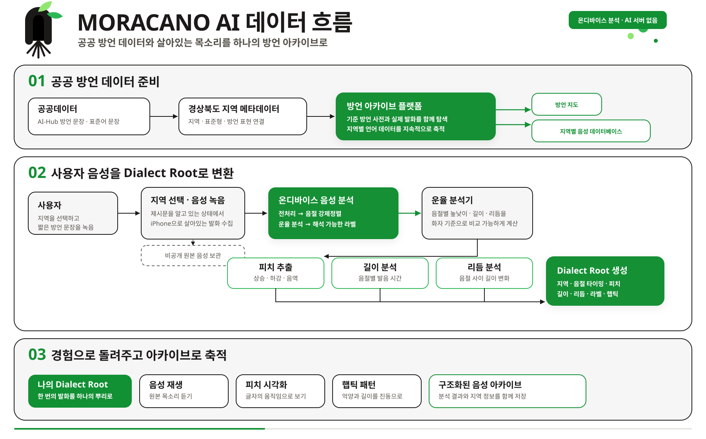

# moracano backend & AI

Moracano는 방언의 단어뿐 아니라 **말할 때 나타나는 높낮이, 길이, 리듬**을 기록하는
온디바이스 음성 AI 프로젝트입니다.

사용자가 제시된 방언 문장을 읽으면 iPhone이 음성을 음절 단위로 나누고, 각 음절의 억양과 길이,
리듬을 분석합니다. 분석 결과는 글자의 움직임, 진동, 원본 음성으로 표현되며 하나의 구조화된
`Dialect Root`로 저장됩니다.

모든 핵심 분석은 iPhone에서 on device로 실행됩니다. 저장 계층은 제시문·방언 사전·분석 결과와 비공개 원본 음성을 보관하는 역할만 담당합니다.

## 온디바이스 AI 한눈에 보기


## AI가 음성을 처리하는 방법

### 1. 알고 있는 문장에서 음절 위치 찾기

Moracano는 사용자가 읽을 제시문을 이미 알고 있기 때문에 음성을 처음부터 다시 받아쓰지 않습니다. 음성 분석은 다음과 같이 이루어 집니다.

wav2vec2 기반 Korean Jamo CTC 모델이 녹음 속 한글 자모의 위치를 찾고, 이를 제시문과 비교해 각 음절의 시작점과 끝점을 계산합니다. 이 과정을 **강제정렬**이라고 합니다.

즉, 무슨 말을 했는지 추측하는 AI 모델이 아니라, **알고 있는 문장을 언제 어떻게
발음했는지 찾는 AI 모델**입니다.

<details>
<summary>강제정렬 기술 세부사항</summary>

- 녹음을 16kHz mono Float32로 맞추고 발화별 음량을 정규화합니다.
- 한글 완성형을 초성·중성·종성 자모로 분해해 `Kkonjeong/wav2vec2-base-korean`의 자모
  vocabulary에 매핑합니다. 이 방식은 `쫌`, `괜`, `걍` 같은 완성형 OOV 문제를 피합니다.
- wav2vec2 CTC의 `log_probs (T, 56)`와 제시문 토큰을 dynamic programming으로 정렬합니다.
- CTC onset이 실제 시작점보다 늦어지는 경향을 줄이기 위해 20ms 보정을 적용합니다.
- 각 음절의 끝은 다음 음절 시작점까지 확장합니다. 마지막 음절은 intensity가 구간 peak보다 20dB
  낮아지는 지점을 발화 끝으로 사용합니다.

구현: `src/moracano_ai/align.py`, `src/moracano_ai/prosody.py`

</details>

### 2. 화자에 맞춰 억양과 리듬 분석하기

사람마다 기본 목소리 높이가 다르므로 음성에 같은 탐색 범위를 적용하면 실제보다 음높이가 두 배 높거나 낮게 측정되는 `octave jump` 문제가 발생할 수 있습니다.

Moracano는 음높이를 두 번 측정합니다. 첫 번째 측정으로 화자의 대략적인 음역을 찾고, 두 번째 측정에서는 그 화자에게 맞는 범위로 다시 분석합니다.

또한 단순한 Hz 값 대신 각 화자의 중앙 음높이를 기준으로 얼마나 올라가고 내려갔는지를 **반음 단위**로 계산합니다. 따라서 목소리가 낮은 사람과 높은 사람도 같은 기준에서 억양을 비교할 수 있습니다. 그리고 짧은 음절과 긴 음절은 같은 변화량도 다르게 들릴 수 있으므로 음절 길이도 함께 고려합니다.

Moracano가 한 번의 발화에서 계산하는 특징은 9개입니다.

| 구분 | 쉽게 설명한 의미 | 실제 필드 |
| --- | --- | --- |
| 음높이 | 평균 높이, 억양의 기복, 전체 음역 | `avg_pitch`, `pitch_std`, `pitch_range` |
| 문장 끝 억양 | 마지막 200ms가 올라가는지 내려가는지 | `pitch_slope_end` |
| 음절 | 실제로 정렬된 음절 수 | `syllable_count` |
| 발음 길이 | 평균 음절 길이와 음절별 길이 차이 | `avg_duration`, `duration_std` |
| 리듬 | 이웃한 음절 사이의 길이 변화 | `npvi` |
| 말하기 속도 | 1초 동안 발음한 음절 수 | `speaking_rate` |

<details>
<summary>운율 분석 기술 세부사항</summary>

첫 번째 F0 탐색은 60–700Hz 범위에서 수행합니다. 유성 프레임의 q25/q75로 화자별
`floor/ceiling`을 구한 뒤 F0를 다시 추출합니다. 피치 변화는 발화 중앙값 F0 기준 반음으로
변환합니다.

음절별 상승·하강·평탄 판정에는 음절 길이 `T`를 반영하는 't Hart glissando threshold를
사용합니다.

```text
0.16 / max(T, 0.08)^2
```

구현: `src/moracano_ai/features.py`, `src/moracano_ai/prosody.py`

</details>

### 3. 숫자를 사람이 이해할 수 있는 특징으로 바꾸기

계산된 음향 값은 사용자가 이해할 수 있는 세 가지 설명으로 변환됩니다.

| 분석 결과 | 의미 | 현재 기준 |
| --- | --- | --- |
| 상승 억양 | 문장 끝이 뚜렷하게 올라감 | `pitch_slope_end > 25 st/s` |
| 긴 음절 | 음절을 비교적 길게 발음함 | `avg_duration > 0.23s` |
| 강한 리듬 변화 | 이웃한 음절 사이의 길이 차이가 큼 | `nPVI > 76` |

이 결과는 **얼마나 방언스럽게 말했는지 평가하는 점수**가 아닙니다. AI-Hub 경상도 실발화
600개에서 관찰한 분포를 기준으로, 현재 녹음에서 두드러진 말투의 특징을 설명한 것입니다.

구현: `src/moracano_ai/labels.py`, `scripts/calibrate_thresholds.py`

### 4. 분석 결과를 다감각 경험으로 바꾸기

Moracano는 분석 결과를 숫자와 그래프로만 보여주지 않습니다.

- **글자의 움직임**: 음절의 시작점과 길이는 글자가 나타나는 시간이 되고, 억양의 상승과 하강은
  움직이는 방향이 됩니다.
- **햅틱**: 음절 길이는 진동의 지속시간이 되고, 피치 변화는 진동의 질감과 강도 변화가 됩니다.
- **원본 음성**: 사용자는 자신의 실제 발화를 분석 결과와 함께 다시 들을 수 있습니다.
- **Dialect Root**: 지역, 제시문, 음절 타이밍, 피치, 길이, 리듬, 라벨과 AHAP 패턴을 하나의
  구조화된 결과로 연결합니다.

키네틱 타이포그래피와 햅틱은 **같은 음성에서 추출한 동일한 특징을 서로 다른 감각으로 표현한 결과**입니다.

`build_ahap_pattern()`의 출력은 Apple AHAP 구조이므로 iOS에서
`CHHapticPattern(dictionary:)`에 직접 전달할 수 있습니다.

구현: `src/moracano_ai/haptic.py`, `mocks/on-device-analysis-contract.json`

## 전체 데이터 흐름



### 공공데이터에서 기준 방언 사전으로

AI-Hub 자료에는 방언 문장, 대응하는 표준어 문장, 지역 정보와 정렬된 `eojeol_list`가 들어
있습니다. `scripts/seed_challenge_sentences.py`는 이 자료에서 **표준형, 지역별 방언 표현, 실제 예문**의 관계를 정리해 방언 사전을 구성합니다.

이 과정은 AI가 검증된 `eojeol_list`에 같은 규칙을 반복 적용하는 데이터 정리 과정입니다. 이후 어떤 원문에서 표준형과 방언 표현이 만들어졌는지 조회할 수 있습니다.

### 살아있는 목소리에서 Dialect Root로

사용자가 지역과 문장을 선택해 녹음하면 iPhone이 음절을 정렬하고 피치·길이·리듬을 계산합니다.
결과는 글자의 움직임, 햅틱과 음성 재생으로 즉시 돌아오며, 구조화된 음성 아카이브에도 연결됩니다.

원본 음성은 소유자별 비공개 Storage에 보관합니다. 핵심 AI 분석은 저장소나 서버가 아니라 사용자의
iPhone에서 수행합니다.

## Core ML 온디바이스 전환

Python 구현은 분석 알고리즘의 기준 결과를 만드는 reference implementation입니다. 실제 앱에서는
약 94M 파라미터의 wav2vec2 모델을 약 99MB의 Core ML int8 패키지로 변환해 iPhone에서 실행합니다.

| 항목 | 적용 내용 |
| --- | --- |
| 입력 | `audio (1, L)` Float32, 16kHz, 0.5–15초 |
| 출력 | `log_probs (1, T, 56)` Float32 |
| 배포 대상 | iOS 18, Core ML `mlprogram` |
| 기준 패키지 | fp16 189MB |
| 앱용 패키지 | per-channel int8 약 99MB |
| 정밀도 보호 | feature extractor conv 7개와 `lm_head` 약 9MB는 fp16 유지 |
| 공통 명세 | `src/moracano_ai/spec.py` → `alignment_spec.json` |

0 padding을 사용하는 고정 입력 크기는 라벨 일치율을 떨어뜨려 제외했습니다. 대신 실제 녹음 길이를
유지하는 `RangeDim`을 사용하고, 입력 정규화도 모델 안에 포함해 Python과 Swift의 전처리 차이를
줄였습니다.

- 변환: `scripts/export_coreml.py`
- 양자화 비교: `src/moracano_ai/quant_sim.py`

## 실제 방언 음성으로 검증

AI-Hub 경상도 방언 실발화 600개와 기존 MFA 음절 정렬 결과를 기준으로 평가했습니다.

| 검증 항목 | 결과 | 의미 |
| --- | --- | --- |
| 음절 시작 오차 중앙값 | 36ms | 전체 오차의 절반이 36ms 이하 |
| 100ms 이내 시작점 | 91% | 대부분의 음절 시작점을 0.1초 안에서 찾음 |
| int8 시작 프레임 일치율 | 98.6% | 경량 모델이 기준 모델의 위치를 거의 유지 |
| int8 라벨 일치율 | 99.3% | 경량화 전후의 특징 설명이 거의 동일 |

AI-Hub 라이선스 조건에 따라 원본 오디오는 저장소에 재배포하지 않았습니다.

`export_parity_fixtures.py`는 CTC 경로, 음절 경계, F0/intensity, 9개 특징, 라벨과 AHAP을
JSON으로 내보냅니다. Swift가 같은 형식으로 결과를 출력하면 `compare_parity.py`가 Python 기준과의 차이를 자동으로 판정합니다.

검증: `scripts/validate_alignment.py`, `scripts/export_parity_fixtures.py`,
`scripts/compare_parity.py`, `tests/test_parity_fixtures.py`

## 저장 계층


저장 계층은 AI 파이프라인의 입력과 결과를 연결하는 보조 역할만 합니다.

- 기준 방언 사전과 제시문은 공개 읽기 전용 데이터로 제공합니다.
- 원본 사용자 음성은 소유자별 비공개 Storage에 저장합니다.
- 온디바이스 분석 결과는 `voices`에 기록합니다.
- 별도 AI 서버나 서비스 계정 키를 iOS 앱에 두지 않습니다.

## 주요 코드

| 경로 | 역할 |
| --- | --- |
| `src/moracano_ai/align.py` | wav2vec2 CTC 추론과 음절 강제정렬 |
| `src/moracano_ai/prosody.py` | 화자 맞춤 F0, intensity, 반음·glissando·nPVI 계산 |
| `src/moracano_ai/features.py` | 음절 트렌드와 9개 발화 특징 계산 |
| `src/moracano_ai/labels.py` | 실측 임계값 기반 운율 특징 설명 |
| `src/moracano_ai/haptic.py` | 음절 운율을 Apple AHAP으로 변환 |
| `src/moracano_ai/spec.py` | Python–Swift 공통 상수와 허용 오차 |
| `src/moracano_ai/service.py` | 로컬 검증용 `/analyze`; 프로덕션 서버가 아님 |
| `scripts/export_coreml.py` | fp16/int8 Core ML 패키지와 명세 export |
| `scripts/validate_alignment.py` | AI-Hub–MFA 정렬 품질 검증 |
| `scripts/compare_parity.py` | Python–Swift 결과 비교 |
| `scripts/seed_challenge_sentences.py` | 정렬된 corpus를 lemma/variant 사전으로 정규화 |

## 구현 상세

- `direction.py`의 `pca_coord`는 `avg_pitch`와 `npvi`를 정규화한 placeholder입니다. 학습된
  유사도 모델이나 PCA가 아닙니다.
- lemma/variant 생성은 정렬된 `eojeol_list` 기반 정규화입니다.
- 현재 라벨 기준은 대화체 AI-Hub 분포를 사용합니다. 실제 제시문 낭독 데이터가 충분히 쌓이면 다시 조정해야 합니다.
- Python FastAPI는 기준 파이프라인 검증용이며 프로덕션에 배포하지 않습니다.

## 실행과 테스트

```bash
uv sync
uv run pytest tests/
```

로컬 기준 파이프라인을 HTTP로 확인할 때만 FastAPI를 실행합니다.

```bash
uv run uvicorn moracano_ai.service:app
```

Core ML 변환은 `coremltools 9.0`과 지원되는 Torch 버전을 사용하는 격리 환경에서 실행합니다.
생성되는 `artifacts/coreml/` 모델 패키지는 Git에 포함하지 않습니다.

```bash
uv run --isolated --no-project \
  --with torch==2.7.1 \
  --with transformers==4.46.3 \
  --with coremltools==9.0 \
  --with "numpy<2.3" \
  --with soundfile \
  python scripts/export_coreml.py --out artifacts/coreml
```

## AI 문서

- [AI 파이프라인 요약](docs/ai/README.md)
- [온디바이스 계약과 알고리즘 명세](docs/ai/plan.md)
- [실험·모델 선택·검증 기록](docs/ai/progress.md)
- [Track 1 기획과 평가기준](docs/spec.md)
