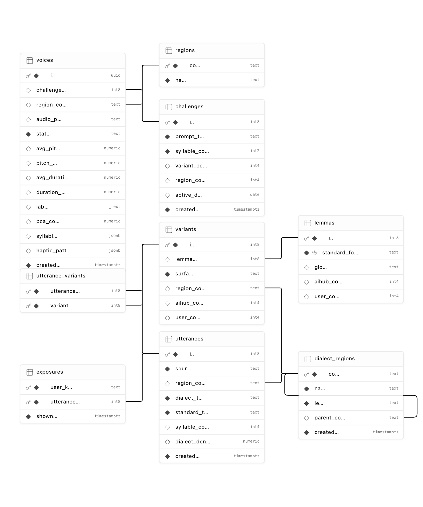

# moracano-server

Moracano는 지역 사투리 발화 데이터를 저장하고, 사용자의 녹음 음성 특징을 시각화하기 위한
Supabase 기반 백엔드입니다. 사용자는 짧은 문장을 녹음하고, 앱은 피치·길이·리듬·음절 타이밍 같은
음성 특징을 분석해 지역 사투리를 더 직관적으로 이해할 수 있게 합니다.

MVP에서는 별도 API 서버나 AI 서버를 두지 않습니다. iOS 앱이 Supabase에서 기준 데이터를 직접
조회하고, 사용자 녹음은 private Storage에 업로드하며, 온디바이스 분석 결과를 Postgres의 `voices`
row에 저장합니다.

## 기획 의도

이 프로젝트는 AI-Hub 방언 데이터를 지역 사투리 예시 corpus의 출발점으로 사용합니다. 각 seed
발화에서 백엔드는 다음 정보를 저장합니다.

- 방언 원문 문장과 대응되는 표준어 문장
- `GB`, `포항`, `경주` 같은 방언 출처 지역
- `이렇게` 같은 표준어 표제어
- `이케` 같은 실제 방언 표면형
- 사용자가 녹음할 challenge 문장

앱은 사용자가 challenge 문장을 녹음하면 온디바이스 분석으로 피치, 길이, 리듬, 음절 타이밍, PCA
좌표, 햅틱 패턴 데이터를 추출합니다. Supabase는 이 결과를 저장하고, 프론트엔드는 저장된 사투리
사전·예시문장·음성 특징을 바탕으로 지역 사투리의 차이를 시각화합니다.

요약하면 다음 흐름입니다.

```text
AI-Hub dialect corpus -> aligned seed utterances -> dialect lexicon
User recording -> on-device feature extraction -> visualization data
```

## 분석 접근

현재 MVP는 서버에서 별도 ML 모델을 학습하지 않습니다. 대신 AI-Hub/curated 데이터를 방언 표현과
예시문장의 기준 corpus로 적재합니다. 각 aligned row는 `eojeol_list`를 통해 표준어 텍스트와 방언
표면형을 연결합니다.

음향 분석은 iOS 온디바이스에서 수행합니다. 앱은 사용자 녹음에서 pitch, duration, rhythm,
syllable timing, haptic feature를 추출하고, 그 결과를 `voices`에 저장합니다. 프론트엔드는
저장된 lexicon, 예시문장, PCA 좌표, label을 사용해 사투리 유사도와 지역별 발화 패턴을 시각화합니다.

## 백엔드 범위

- Supabase Postgres는 지역, challenge, 방언 사전, seed 발화, 사용자 음성 메타데이터, 온디바이스
  분석 결과를 저장합니다.
- Supabase Storage는 사용자 오디오를 private `voices` bucket에 저장합니다.
- Supabase Anonymous Auth는 별도 로그인 UI 없이 `auth.uid()` 기반 사용자 소유권을 제공합니다.
- 프론트엔드는 별도 Swagger API가 아니라 Supabase Swift SDK로 데이터를 조회/수정합니다.
- seed script는 CSV를 DB 테이블 구조에 맞게 정규화합니다.

## ERD



## 데이터 흐름

```text
AI-Hub / seed CSV
        ↓
표준어-방언 어절 alignment
        ↓
Supabase Postgres
challenges · lemmas · variants · utterances
        ↓
iOS App
challenge 조회 → 녹음 → 온디바이스 분석
        ↓
Supabase
private audio 저장 · voices 분석 결과 저장
        ↓
Visualization
지역별 표현 · 음성 특징 · PCA/label/haptic
```

## 주요 테이블

| Table | 역할 |
| --- | --- |
| `regions` | 사용자가 앱에서 선택하는 경북 시군 지역입니다. |
| `dialect_regions` | AI-Hub/seed 데이터의 출처 지역입니다. `GB` 같은 광역 코드와 `포항` 같은 시군 코드를 함께 담을 수 있습니다. |
| `challenges` | 사용자가 녹음할 짧은 제시문장입니다. |
| `voices` | 사용자 녹음 메타데이터와 온디바이스 분석 결과입니다. |
| `lemmas` | 표준어 표제어 전역 사전입니다. 지역 정보는 여기에 저장하지 않습니다. |
| `variants` | 표제어에 연결되는 지역별 방언 표면형입니다. |
| `utterances` | AI-Hub, curated seed, 향후 user source의 방언/표준어 예시문장입니다. |
| `utterance_variants` | 예시문장과 방언 표면형을 연결하는 join table입니다. |
| `exposures` | 어떤 예시문장이 사용자/디바이스에 노출됐는지 기록하는 lightweight log입니다. |

## 음성 분석 레코드

iOS 앱은 로컬 분석이 끝난 뒤 `voices` row를 update합니다.

주요 필드:

- `audio_path`: private Storage object path. 일반적으로
  `{owner_id}/{voice_id}.m4a`
- `avg_pitch`, `pitch_std`: 피치 요약값
- `avg_duration`, `duration_std`: 길이/리듬 요약값
- `labels`: 시각화용 분석 label
- `pca_coord`: map/scatter 시각화를 위한 2D 좌표
- `syllables`: 음절 단위 timing과 pitch trend
- `haptic_pattern`: AHAP 호환 햅틱 패턴 데이터

## 프론트엔드 접근 방식

프론트엔드는 Supabase Swift SDK를 다음 값으로 초기화합니다.

```text
SUPABASE_URL
SUPABASE_PUBLISHABLE_KEY
```

앱 흐름:

1. 기존 session이 없으면 `signInAnonymously()`를 호출합니다.
2. `regions`, `challenges`, `lemmas`, `variants`, `utterances`,
   `utterance_variants`에서 기준 데이터를 조회합니다.
3. `owner_id = session.user.id`로 `voices` row를 생성합니다.
4. private `voices` bucket에 오디오를 업로드합니다.
5. 온디바이스 분석을 실행합니다.
6. 같은 `voices` row에 분석 결과를 update합니다.
7. 짧은 시간만 유효한 음성 재생 URL은 `createSignedURL`로 발급합니다.

Supabase SDK의 메서드명은 `createSignedURL`이지만, private object에 대해 만료 시간이 있는
pre-signed URL을 발급하는 흐름으로 보면 됩니다.

클라이언트 앱에는 service-role key, Management API token, DB password를 넣지 않습니다.

## Seed Challenge Sentences

CSV seed 파일은 `challenges`, `dialect_regions`, `lemmas`, `variants`, `utterances`,
`utterance_variants`로 정규화됩니다.

필수 CSV columns:

```text
prompt_text,dialect_text,standard_text,eojeol_list,region_code,syllable_count,variant_count,region_count,active_date,source_type
```

`eojeol_list`는 JSON array여야 합니다. `is_dialect: true`인 항목만 `lemmas`와 `variants`
생성에 사용합니다.

`eojeol_list` 예시:

```json
[
  {
    "standard": "이렇게",
    "surface": "이케",
    "is_dialect": true
  },
  {
    "standard": "해라.",
    "surface": "해라.",
    "is_dialect": false
  }
]
```

Dry run:

```bash
python3 scripts/seed_challenge_sentences.py /path/to/challenge_sentences.csv --dry-run
```

Apply:

```bash
export SUPABASE_ACCESS_TOKEN="management-api-token-with-database-write"
python3 scripts/seed_challenge_sentences.py /path/to/challenge_sentences.csv
```

AI-Hub 원천 데이터는 `source_type=aihub`, 생성 seed 데이터는 `source_type=synthetic`을 사용합니다.
`region_code`는 방언 데이터의 출처 지역입니다. 사용자가 앱에서 선택한 지역은 `voices.region_code`에
저장됩니다.

## 보안 모델

- 기준 데이터 테이블은 public read-only입니다.
- `voices` row는 Supabase Auth user의 `owner_id`로 소유권을 구분합니다.
- 오디오 파일은 private `voices` bucket에 저장합니다.
- 오디오 재생은 짧은 시간만 유효한 pre-signed URL을 사용합니다.
- 클라이언트 앱은 publishable key만 사용합니다.

## 현재 MVP 상태

- 현재 seed corpus는 synthetic challenge/utterance 116개입니다.
- 현재 seed 출처 지역은 `GB`로 등록되어 있습니다.
- AI-Hub/corpus 확장은 같은 CSV schema를 만들고 `source_type=aihub`로 적재하면 됩니다.
- MVP에서 백엔드는 분석 결과를 저장하고, feature extraction 자체는 iOS 디바이스에서 수행합니다.
