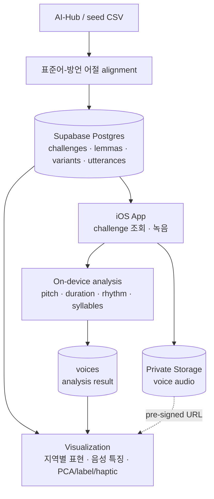

# moracano-server

Moracano는 지역 사투리 발화 데이터를 저장하고, 사용자의 녹음 음성 특징을 시각화하기 위한
Supabase 기반 백엔드입니다. 사용자는 짧은 문장을 녹음하고, 앱은 피치·길이·리듬·음절 타이밍 같은
음성 특징을 분석해 지역 사투리를 더 직관적으로 이해할 수 있게 합니다.

MVP에서는 별도 API 서버나 AI 서버를 두지 않습니다. iOS 앱이 Supabase에서 기준 데이터를 직접
조회하고, 사용자 녹음은 private Storage에 업로드하며, 온디바이스 분석 결과를 Postgres의 `voices`
row에 저장합니다.

## 기획 의도

이 프로젝트는 AI-Hub 방언 데이터를 지역 사투리 예시 corpus의 출발점으로 사용합니다. 각 seed
발화에서 백엔드는 다음 정보를 저장합니다.

- 방언 원문 문장과 대응되는 표준어 문장
- `GB`, `포항`, `경주` 같은 방언 출처 지역
- `이렇게` 같은 표준어 표제어
- `이케` 같은 실제 방언 표면형
- 사용자가 녹음할 challenge 문장

앱은 사용자가 challenge 문장을 녹음하면 온디바이스 분석으로 피치, 길이, 리듬, 음절 타이밍, PCA
좌표, 햅틱 패턴 데이터를 추출합니다. Supabase는 이 결과를 저장하고, 프론트엔드는 저장된 사투리
사전·예시문장·음성 특징을 바탕으로 지역 사투리의 차이를 시각화합니다.

요약하면 다음 흐름입니다.

```text
AI-Hub dialect corpus -> aligned seed utterances -> dialect lexicon
User recording -> on-device feature extraction -> visualization data
```

## 분석 접근

현재 MVP는 서버에서 별도 ML 모델을 학습하지 않습니다. 대신 AI-Hub/curated 데이터를 방언 표현과
예시문장의 기준 corpus로 적재합니다. 각 aligned row는 `eojeol_list`를 통해 표준어 텍스트와 방언
표면형을 연결합니다.

음향 분석은 iOS 온디바이스에서 수행합니다. 앱은 사용자 녹음에서 pitch, duration, rhythm,
syllable timing, haptic feature를 추출하고, 그 결과를 `voices`에 저장합니다. 프론트엔드는
저장된 lexicon, 예시문장, PCA 좌표, label을 사용해 사투리 유사도와 지역별 발화 패턴을 시각화합니다.

## 백엔드 범위

- Supabase Postgres는 지역, challenge, 방언 사전, seed 발화, 사용자 음성 메타데이터, 온디바이스
  분석 결과를 저장합니다.
- Supabase Storage는 사용자 오디오를 private `voices` bucket에 저장합니다.
- Supabase Anonymous Auth는 별도 로그인 UI 없이 `auth.uid()` 기반 사용자 소유권을 제공합니다.
- 프론트엔드는 별도 Swagger API가 아니라 Supabase Swift SDK로 데이터를 조회/수정합니다.
- seed script는 CSV를 DB 테이블 구조에 맞게 정규화합니다.

## ERD


## 데이터 흐름



## 주요 테이블

| Table | 역할 |
| --- | --- |
| `regions` | 사용자가 앱에서 선택하는 경북 시군 지역입니다. |
| `dialect_regions` | AI-Hub/seed 데이터의 출처 지역입니다. `GB` 같은 광역 코드와 `포항` 같은 시군 코드를 함께 담을 수 있습니다. |
| `challenges` | 사용자가 녹음할 짧은 제시문장입니다. |
| `voices` | 사용자 녹음 메타데이터와 온디바이스 분석 결과입니다. |
| `lemmas` | 표준어 표제어 전역 사전입니다. 지역 정보는 여기에 저장하지 않습니다. |
| `variants` | 표제어에 연결되는 지역별 방언 표면형입니다. |
| `utterances` | AI-Hub, curated seed, 향후 user source의 방언/표준어 예시문장입니다. |
| `utterance_variants` | 예시문장과 방언 표면형을 연결하는 join table입니다. |
| `exposures` | 어떤 예시문장이 사용자/디바이스에 노출됐는지 기록하는 lightweight log입니다. |

## 음성 분석 레코드

iOS 앱은 로컬 분석이 끝난 뒤 `voices` row를 update합니다.

주요 필드:

- `audio_path`: private Storage object path. 일반적으로
  `{owner_id}/{voice_id}.m4a`
- `avg_pitch`, `pitch_std`: 피치 요약값
- `avg_duration`, `duration_std`: 길이/리듬 요약값
- `labels`: 시각화용 분석 label
- `pca_coord`: map/scatter 시각화를 위한 2D 좌표
- `syllables`: 음절 단위 timing과 pitch trend
- `haptic_pattern`: AHAP 호환 햅틱 패턴 데이터

## 프론트엔드 접근 방식

프론트엔드는 Supabase Swift SDK를 다음 값으로 초기화합니다.

```text
SUPABASE_URL
SUPABASE_PUBLISHABLE_KEY
```

앱 흐름:

1. 기존 session이 없으면 `signInAnonymously()`를 호출합니다.
2. `regions`, `challenges`, `lemmas`, `variants`, `utterances`,
   `utterance_variants`에서 기준 데이터를 조회합니다.
3. `owner_id = session.user.id`로 `voices` row를 생성합니다.
4. private `voices` bucket에 오디오를 업로드합니다.
5. 온디바이스 분석을 실행합니다.
6. 같은 `voices` row에 분석 결과를 update합니다.
7. 짧은 시간만 유효한 음성 재생 URL은 `createSignedURL`로 발급합니다.

Supabase SDK의 메서드명은 `createSignedURL`이지만, private object에 대해 만료 시간이 있는
pre-signed URL을 발급하는 흐름으로 보면 됩니다.

클라이언트 앱에는 service-role key, Management API token, DB password를 넣지 않습니다.

## Seed Challenge Sentences

CSV seed 파일은 `challenges`, `dialect_regions`, `lemmas`, `variants`, `utterances`,
`utterance_variants`로 정규화됩니다.

필수 CSV columns:

```text
prompt_text,dialect_text,standard_text,eojeol_list,region_code,syllable_count,variant_count,region_count,active_date,source_type
```

`eojeol_list`는 JSON array여야 합니다. `is_dialect: true`인 항목만 `lemmas`와 `variants`
생성에 사용합니다.

`eojeol_list` 예시:

```json
[
  {
    "standard": "이렇게",
    "surface": "이케",
    "is_dialect": true
  },
  {
    "standard": "해라.",
    "surface": "해라.",
    "is_dialect": false
  }
]
```

Dry run:

```bash
python3 scripts/seed_challenge_sentences.py /path/to/challenge_sentences.csv --dry-run
```

Apply:

```bash
export SUPABASE_ACCESS_TOKEN="management-api-token-with-database-write"
python3 scripts/seed_challenge_sentences.py /path/to/challenge_sentences.csv
```

AI-Hub 원천 데이터는 `source_type=aihub`, 생성 seed 데이터는 `source_type=synthetic`을 사용합니다.
`region_code`는 방언 데이터의 출처 지역입니다. 사용자가 앱에서 선택한 지역은 `voices.region_code`에
저장됩니다.

## 보안 모델

- 기준 데이터 테이블은 public read-only입니다.
- `voices` row는 Supabase Auth user의 `owner_id`로 소유권을 구분합니다.
- 오디오 파일은 private `voices` bucket에 저장합니다.
- 오디오 재생은 짧은 시간만 유효한 pre-signed URL을 사용합니다.
- 클라이언트 앱은 publishable key만 사용합니다.

## AI 분석 파이프라인 (레퍼런스 구현)

`src/moracano_ai/`는 온디바이스(iOS Core ML) 분석 로직의 **Python 레퍼런스 구현 + 검증 도구**입니다.
프로덕션 트래픽을 받는 서버가 아니라, (1) Swift 포팅의 정답지 역할, (2) AI-Hub 실데이터로 알고리즘을
검증하는 용도로 존재합니다.

- `align.py`: 제시어 텍스트를 오디오에 강제정렬(forced alignment)해 음절 타이밍을 계산합니다. ASR로
  전사하지 않습니다 — 제시어는 이미 알고 있으므로 "이 텍스트가 오디오 어디에 있는지"만 찾습니다.
- `prosody.py`: 피치(F0) 추출과 발화 끝(intensity 기반) 추정을 담당합니다.
- `features.py`, `labels.py`: 피치/길이/리듬 9개 피처와 임계값 기반 라벨(Rising Intonation 등)을 계산합니다.
- `haptic.py`: 음절별 억양 추세를 Apple AHAP 포맷(`CHHapticPattern(dictionary:)`에 바로 사용 가능)으로 변환합니다.
- `service.py`: 위 파이프라인을 FastAPI로 감싼 로컬 검증용 엔드포인트(`/analyze`). 배포하지 않습니다.

### 검증 스크립트 (`scripts/`)

- `validate_alignment.py`: AI-Hub 경상도 방언 발화로 강제정렬 결과를 MFA(기존 정렬 도구)와 비교합니다.
- `calibrate_thresholds.py`: 실측 피처 분포로 라벨 임계값을 다시 잡습니다.
- `export_coreml.py`: 정렬 모델을 CoreML(`.mlpackage`, fp16/int8)로 변환합니다.
- `export_parity_fixtures.py` / `compare_parity.py`: Python 출력과 Swift 온디바이스 출력이 같은 값을
  내는지 대조하는 파리티 테스트 픽스처를 만들고 비교합니다.

전체 실험 과정(모델 선택, 버그 수정, 임계값 캘리브레이션, 양자화 비교)은 `docs/ai/progress.md`에,
현재 계약과 알고리즘 명세는 `docs/ai/plan.md`에 정리돼 있습니다.

### 검증 데이터셋

AI-Hub "한국어 방언 발화 데이터(경상도)"(datasetKey 119) 실발화 600개(young/old 각 300, 화자 연령
10대~60대 이상)를 사용했습니다. TTS 합성음이 아니라 실제 녹음이고, 정렬 결과는 같은 코퍼스에 대해
이미 계산돼 있던 MFA(Montreal Forced Aligner) 정렬을 정답으로 삼아 대조했습니다. AI-Hub 데이터는
재배포가 금지돼 있어 오디오 자체는 이 레포에 없고(팀 GPU 서버에만 존재), 검증 결과만 문서로 남깁니다.

### 성능

| 지표 | large(317M, 서버용) | base(94M, 온디바이스 기본값) |
|---|---|---|
| 음절 onset 오차 중앙값 (MFA 대비) | 29ms | 36ms |
| 50ms 이내 | 80% | 64% |
| 100ms 이내 | 94% | 91% |
| 정렬 지연 (GPU) | 26ms | 19ms |
| 정렬 지연 (서버 CPU 48코어) | 0.27s | — |

- CoreML 양자화: fp16(189MB) 대비 **int8(99MB)** 채널별 양자화가 정확도 손실 거의 없이(fp32 대비 음절
  시작 프레임 일치율 98.6%, 라벨 일치율 99.3%) 배포 크기를 절반으로 줄여 최종 채택.
- 라벨 분포(599발화 실측): Rising Intonation 11%, Long Vowel Usage 26%, Strong Rhythm Variation 26%.
- 자세한 실험별 수치와 방법론은 `docs/ai/progress.md`의 날짜별 세션 기록 참고.

### 실행

```bash
uv sync
uv run pytest tests/
```

## 현재 MVP 상태

- 현재 seed corpus는 synthetic challenge/utterance 116개입니다.
- 현재 seed 출처 지역은 `GB`로 등록되어 있습니다.
- AI-Hub/corpus 확장은 같은 CSV schema를 만들고 `source_type=aihub`로 적재하면 됩니다.
- MVP에서 백엔드는 분석 결과를 저장하고, feature extraction 자체는 iOS 디바이스에서 수행합니다.
