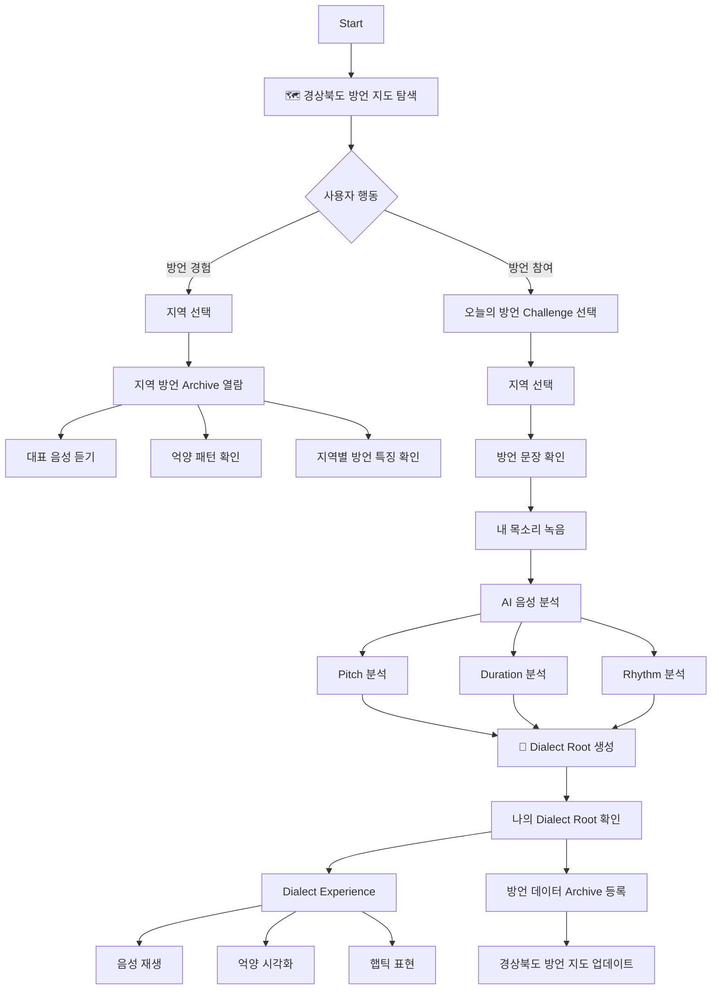
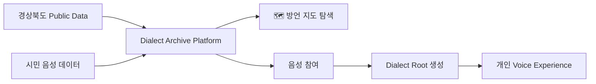
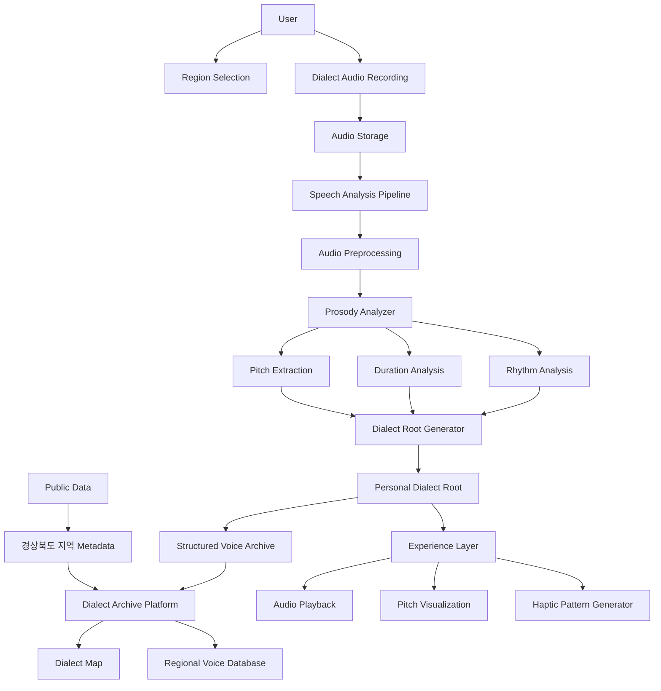

### Track Challenge

> **Use Public Data to Solve Real Challenges in Gyeongsangbuk-do**
You must utilize at least one piece of public data.
> 

#### Choose one or more of the two branches

1. **Building Data Infrastructure**
    
    Public data related to Gyeongsangbuk-do
    (or those helpful to Gyeongsangbuk-do administration) is processed and disclosed in a format that AI can immediately use, such as MCP servers, open-source skills, and plugins, in a standardized manner.
    
2. **Regional Problem-Solving Services**
    
    Freely discovering and analyzing various regional issues in Gyeongsangbuk-do using open data and AI, and developing AI-based services and solutions to solve regional problems.
    

#### **Criteria**

- Technical Excellence (25%)
    
    Solution quality, technical soundness, and effective use of AI and public data
    
- Public Value & Applicability (35%)
    
    Potential to address real public needs and create measurable local impact
    
- Innovation & Differentiation (25%)
    
    Originality, creativity, and uniqueness compared to existing approaches
    
- Sustainability & Scalability (15%)
    
    Long-term viability, maintainability, and potential for broader adoption
    
- Prototype Bonus (10%)
    
    Additional credit for working demonstrations such as chatbots, web apps, dashboards, or services
    

---

# 문제 정의

<aside>

**1. 지역 방언 데이터의 부족**

---

- AI 음성 모델은 표준어를 중심으로 학습됨
- 지역 방언, 특히 세대별 표현 차이는 데이터 부족 (확인 필요)

**→ 결과적으로 AI 서비스에서 지역 사용자의 언어 경험이 소외된다!**

**→ "AI 시대의 언어 격차”**

</aside>

<aside>

**2. 방언은 빠르게 소멸하는 지역 문화 자원**

---

- 젊은 세대의 표준어 사용 증가
- 지역 고유 표현 감소
- 기존 방언 연구 데이터는 연구자 중심 수집 (public이 아님)

**→ 일반 시민이 참여하는 지속 가능한 수집 구조 필요하다!**

</aside>

<aside>

3. 기존 방언 아카이브의 한계 존재

---

- 녹음 파일 저장 / 수집
- 전문가 조사
- 정적인 데이터베이스 형태로 서빙

**→ 참여 동기가 부족하고, 지속적인 데이터 축적이 어렵다!**

</aside>

# moracano

**사라지는 소리를 새로운 방식으로 보존하는 경상북도 방언 아카이브 플랫폼**

“moracano는 지역 방언의 음성적 특징을 분석하고, 이를 시각·촉각적 경험으로 확장하여 사용자가 지역의 고유한 말투를 직접 경험할 수 있도록 하는 참여형 방언 아카이브 플랫폼이다.”

<aside>

기존 아카이브

**텍스트 + 음성 파일**

</aside>

<aside>

**moracano**

**텍스트 + 음성 + 억양 패턴 + 시각 · 촉각 표현**

</aside>

### 프로젝트 소개

moracano는 지역 방언의 음성적 특징을 분석하고, 이를 시각·촉각적 경험으로 확장하여 사용자가 지역의 고유한 말투를 직접 경험할 수 있도록 하는 참여형 방언 아카이브 플랫폼이다.

기존 방언 아카이브는 대부분 단어와 의미를 중심으로 기록되어 왔다. 하지만 **방언은 단순한 텍스트가 아니라, 지역마다 다른 억양, 말의 길이, 리듬과 같은 음성적 특징을 포함하는 문화유산이다**.

특히 지역과 세대에 따라 나타나는 다양한 발화 방식은 텍스트로 표현하기 어렵고, 음성 데이터 없이 보존하기 어렵다.

moracano는 사용자의 음성을 기반으로 **Dialect Root(언어적 뿌리)를** 생성하여, 개인의 발화 다양성과 지역 언어 문화를 새로운 형태의 데이터로 기록한다.

### 기술 키워드

<aside>

Speech AI, Prosody Analysis, Dialect Fingerprint, Speech Visualization, Core Haptics, Public Data Platform

</aside>

### 목적 및 필요성

#### **1. 방언은 텍스트가 아닌 소리로 존재하는 언어 문화이다.**

기존 방언 데이터는 주로 특정 표현과 표준어 의미를 연결하는 형태로 구축되어 왔다.

하지만 실제 사람의 말에는 억양 변화(Pitch Contour), 음절 길이(Duration), 발화 리듬(Rhythm), 개인별 표현 방식 과 같은 다양한 음성적 특징이 포함되어 있다.

예를 들어 같은 표현이라도 화자의 발화 방식에 따라 전달되는 느낌과 지역적 특징이 달라지며, 이를 텍스트만으로 기록할 경우 언어의 중요한 정보가 사라진다.

따라서 **다양한 사람의 목소리가 가진 특징을 보존하기 위해서는 텍스트뿐 아니라 음성과 음성 특징 데이터를 함께 기록하는 새로운 방식이 필요**하다.

#### 2. AI 시대의 언어 다양성 데이터 부족

현재 음성 AI 모델은 대규모 표준어 중심 데이터에 기반하여 학습되는 경우가 많다.

하지만 실제 사용자의 언어는 지역적 배경, 세대 차이, 성장 환경, 개인의 발화 습관 등에 따라 다양하게 나타난다.

이러한 발화 다양성이 충분히 반영되지 않을 경우, AI 서비스에서 다양한 사용자의 언어 경험을 제대로 이해하기 어렵다.

moracano는 시민 참여를 통해 다양한 실제 발화 데이터를 수집하여 AI 시대의 언어 다양성 격차를 줄이는 것을 목표로 한다.

#### 3. 기존 음성 아카이브의 한계

기존 음성 기록은 대부분 녹음 파일 저장, 연구 목적의 제한적 수집, 정적인 데이터베이스의 형태로 제공된다. 

하지만 일반 시민이 지속적으로 참여할 동기가 부족하여, 변화하는 지역 언어와 개인의 다양한 발화를 장기적으로 기록하기 어렵다.

moracano는 사용자가 자신의 언어적 특징을 발견하는 경험을 통해 자연스럽게 데이터가 축적되는 참여 플랫폼을 만든다.

### 프로젝트 개요

#### 1. Dialect Root 생성

사용자가 자신의 발화를 녹음하면 AI가 음성 특징을 분석하여 개인별 Dialect Root를 생성한다.

Dialect Root는 특정 지역을 단순히 분류하는 것이 아니라, 사용자의 목소리에 담긴 다양한 발화 특징을 표현한다.

분석 요소:

```
- Pitch contour (억양 변화)
    
    !File_Cantarutti_intonation_Fig1.jpg
    
    !File_Cantarutti_intonation_Fig6-rise-fall.jpg
    
- Duration (음절 길이)
- Rhythm (발화 패턴)
- Regional vocabulary (지역 표현)
```

결과 예시:

```
🌳 Your Dialect Root

Voice Pattern

↗ Rising Intonation
━ Long Vowel Usage
● Strong Rhythm Variation

Language Background

Pohang, Gyeongsangbuk-do

Similar Voices

Yeongdeok
Gyeongju
```


#### 2. 구조화된 음성 데이터 아카이브 구축

사용자의 참여 데이터를 다음 정보를 포함하는 구조화된 데이터로 구축한다.

$$
\text{Audio}\,+\,\text{Transcript}\,+\,\text{Speech Feature}\,+\,\text{Region Metadata}
$$

→ 기존의 텍스트 중심 방언 사전을 넘어, **실제 발화 특성을 포함한 경상북도 음성 데이터 인프라를 구축 가능!**

#### 3. Dialect Experience

분석된 방언 특징을 다양한 방식으로 표현한다.

- **음성 재생을 통한 실제 발화 경험**
- **억양 패턴 시각화**
    
    ```
    뭐   라   카   노
    
    ↗   ↘   ↗   ↘
    ```
    
- **햅틱 기반 촉각 표현**
    
    ```
    뭐   라   카   노
    
    짧   짧   길   상승
    
    ●   ●   ━━━   ●↑
    ```
    

→ 사용자는 방언을 단순히 읽는 것이 아니라, 지역의 고유한 소리와 말투를 직접 경험할 수 있다.

### 왜 경상북도인가?

경상북도는 다양한 지역적·세대적 언어 특징이 공존하는 지역이다.

같은 경상권 안에서도 동해안 지역, 북부 산간 지역, 도시권 지역 등에서 서로 다른 발화 특징이 나타난다.

**따라서 경상북도는 개인과 지역의 다양한 언어 뿌리를 기록하고, 시민 참여형 음성 데이터 인프라를 구축하기 위한 적합한 시작점이다.**

### 결과물 활용 방안 및 기대효과

#### 1. 경상북도 방언 데이터 인프라 구축

시민 참여를 통해 지역별 음성 데이터를 지속적으로 확보하고, 한국어 음성 AI가 다양한 지역 언어를 이해할 수 있는 기반 데이터를 구축한다.

- 한국어 음성 AI 개선
- 지역 방언 연구
- 지역 문화 데이터 구축
- 언어 데이터 구축

#### 2. 지역 언어 문화 보존

방언은 지역 주민의 삶과 세대의 기억이 담긴 언어 유산이다.

moracano는 사라지는 지역의 목소리를 기록하고, 단순한 단어 보존을 넘어 실제 사람들이 사용하는 말투와 발화 특징까지 보존하는 디지털 문화 아카이브를 구축한다.

#### 3. 시민 참여 기반 지속 가능한 데이터 수집

사용자는 자신의 Dialect Root를 확인하고 다른 사람들과 비교하는 경험을 통해 자연스럽게 음성 데이터 구축에 참여한다.

이를 통해 기존 연구자 중심의 방언 기록 방식을 넘어, 시민이 함께 만드는 참여형 언어 데이터 플랫폼으로 확장한다.

활용 가치:

1. AI 음성 서비스 개선
    - 지역 음성 데이터 확보
    - 한국어 ASR 편향 개선
2. 문화 기록
    - 사라지는 지역 언어 보존
    - 세대 간 언어 연결
3. 지역 브랜딩
    - 경북 방언 지도 (경상북도 세부 지역 랭킹/지도 등)
    - 관광 콘텐츠
    - 지역 문화 교육 자료

---

# moracano User Flow





# moracano Architecture



---

**Input:** 

```
User Audio
+
Challenge Text
+
Region Metadata
```

**AI Processing:**

```
Audio Signal

 ├── Pitch Contour
 ├── Duration
 └── Rhythm

        ↓

Dialect Feature Vector

        ↓

Dialect Root
```

**Output:**

```
Personal Dialect Root

+
Experience

 ├── Voice Playback
 ├── Visualization
 └── Haptic Pattern

+
Public Archive

 └── Gyeongsangbuk-do Dialect Map
```

---
